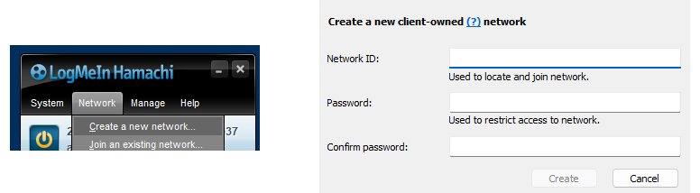
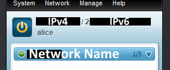
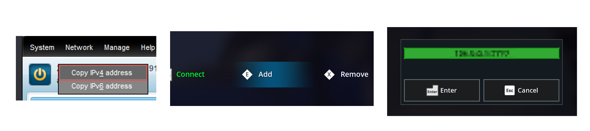

# Hamachi Hosting Guide

This is a guide on how to host a Frozen Flame server on your PC and have your friends connect to it via Hamachi.

### Setting up the server

Download the server files, either via SteamCMD or by going to your **`Steam Library > Frozen Flame Dedicated Server`**. Create a `.bat` file with which you'll start your server.

**`SERVER.bat`**
```bat
"Path/To/FrozenFlameServer.exe" -log -LOCALLOGTIMES -MetaGameServerName="server_name" -ip="127.0.0.1" -Port=7777 -queryPort=25575 -RconPort=27015 -RconPassword="rcon_password"
```


### Installing Hamachi

Head over to the [Hamachi download website](https://www.vpn.net/) (https://www.vpn.net/) then download and install Hamachi. When you first open the Hamachi app and press the ON/OFF button under the **System** tab, you will be prompted to login/sign-up.

Once you've done so, head over to **`Network > Create a new network...`**. In **Network ID** put a unique network identifier that you'll be able to remember, and in **Password** create a secure password that your friends will use to join you, then click **Create**. [1]

You should be able to see your network in the network list. [2]

[1]


[2]



### Connecting to the server

Start your **`SERVER.bat`** then open the game. Head over to the **Private Game**, then **Add**. For **IP:Port**, you're going to put the **IPv4** from Hamachi. To do so, right click the addresses in **`Hamachi > Copy IPv4 address`**. 

Then add it to the server list in-game. [3]

[3]


You should be able to connect and play with your friend(s) now!
